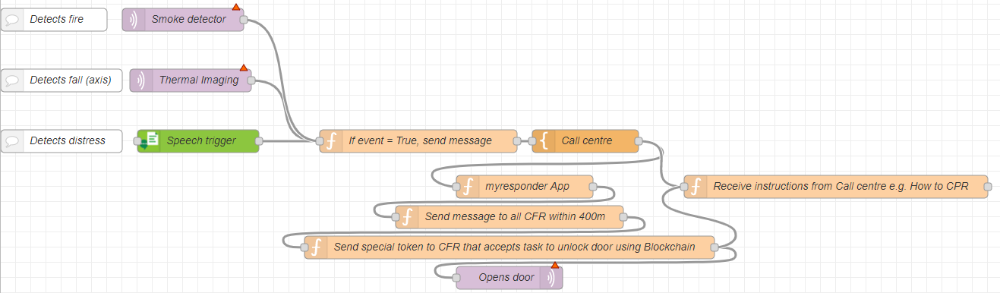
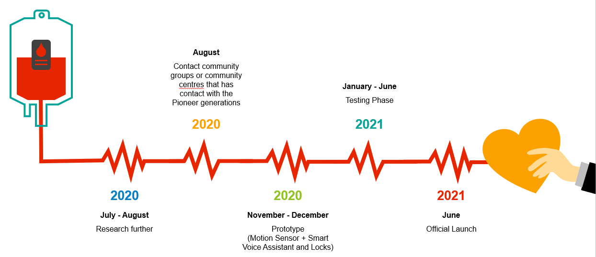

# Rescuers

### a. Short description
With the increasingly aging population living alone, this poses a higher risk for the vulnerable population getting into incidents without being known. The use of technology will help monitor the vulnerable, allow SCDF and CFRs to make better decisions and make sense of the environment. Our team proposed a Thermal Imaging System along with a Smart Voice Assistant and Smart IoT Locks to accurately identify the root cause of the incident and provide aid in the CFR’s sense-making at the onset of incidents and how we can better mobilise them in emergency situations (time-saving).

### b. Pitch Video

### c. Architecture

### d. Long-description
Within the bounds of the house of the vulnerable: Thermal Imaging, Smart Voice Assistant & Smart IoT Locks.

We would like to propose a thermal imaging system that accurately identifies instances when the vulnerable meets with an incident (e.g. a fall) based on the concept of an axis. It also quickly accurately identify the root cause of the incident (eg. cardiac arrest or stroke) based on their past medical records. The Smart Voice Assistant (eg. Siri) will then prompt a message to the vulnerable, through which they will have to give a reply within 5 minutes. If 5 minutes is up and no response is received, SCDF will be alerted. SCDF will send a message through the myResponder app, paging for CFRs within a 400m radius. Should anyone be available to help, a token will be sent to them via the app.

The Smart IoT Locks are required to be installed on the doors of all the vulnerable. The token received from the app is to be used to open the door. This ensures that only authorized, and verified (in terms of identification) people are allowed to enter the homes and perform any saving acts. 

### e. Project Roadmap

### f. Getting started
1. Install Node-Red - https://developer.ibm.com/gettingstarted/node-red/
2. Import this `node_red_draft_import.txt` file in this repository
